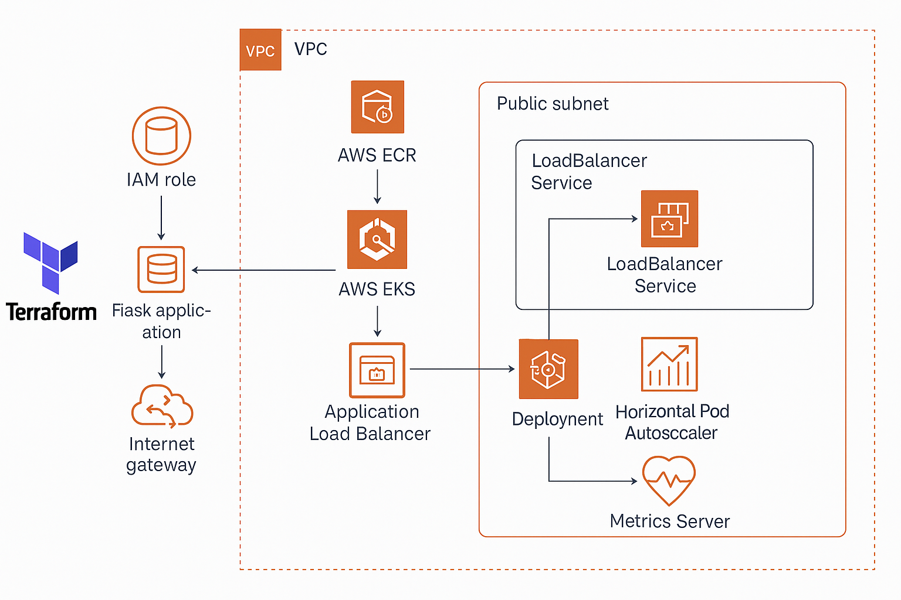

# Terraform EKS + ECR Project 🚀

This project demonstrates a complete DevOps workflow using **Terraform** to provision **AWS EKS** and **ECR**, along with deploying a containerized **Flask application** on the cluster.

## 🔧 Tech Stack

- **Terraform** (Infrastructure as Code)
- **AWS EKS** (Kubernetes Cluster)
- **AWS ECR** (Docker Image Registry)
- **Flask** (Web Application)
- **Kubernetes** (Deployments, Services, HPA)
- **HPA** (Horizontal Pod Autoscaler)
- **AWS ALB** (Load Balancer)

## 🏗️ Folder Structure

```
terraform-eks-ecr/
├── modules/
│   ├── vpc/          # VPC, subnets, IGW, etc.
│   ├── iam/          # IAM roles for EKS cluster + nodes
│   ├── ecr/          # ECR repo for docker image
│   └── eks/          # EKS cluster, node group
├── environments/
│   └── dev/
│       ├── main.tf
│       ├── variables.tf
│       ├── outputs.tf
│       └── providers.tf
├── simple-webapp-flask/
│   ├── app.py
│   ├── Dockerfile
│   ├── requirements.txt
│   └── k8s/
│       ├── application/
│       │   ├── deployment.yaml
│       │   ├── service.yaml
│       │   └── hpa.yaml
│       └── monitoring/ 
│           ├── prometheus
│           └── hpa.yaml
└── README.md
```

## 🌐 Accessing the App

After deploying, your Flask app is exposed via an AWS ALB:

```bash
http://<your-alb-dns>
```

## 📈 Autoscaling with HPA

Horizontal Pod Autoscaler is configured to monitor CPU usage and scale replicas between 1 and 5 dynamically based on load.

You can test load using:

```bash
python3 -c "import requests; [requests.get('http://<your-alb-dns>') for _ in range(1000)]"
```

## 📸 Architecture Overview



## 🧠 Next Steps

- Add logging & monitoring (e.g., Prometheus + Grafana)
- Integrate CI/CD using GitHub Actions or Jenkins
- Secure with IAM OIDC + IRSA for workload identity

---

Made with ❤️ by a passionate DevOps engineer.
